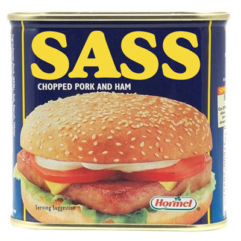

## Sass List–Maps

Forward-compatible list-based map (hash) functionality for [libsass](https://github.com/hcatlin/libsass) and [ruby-sass](http://sass-lang.com/) < 3.3.x.



*Some Sass hash.*

##### Update: You can now install this as a Bower package or Compass extension:

```sh
# bower
bower install sass-list-maps
# compass
gem install sass-list-maps
```

### Introduction

Maps (also known as hashes or objects\*) allow dynamic creating, setting and retrieving of data. They are supported natively in ruby-sass as of version 3.3.rc1 with new syntax and functions; but for earlier ruby-sass versions—and for the increasingly popular ultra-fast libsass C-based compiler (until the point at which maps are integrated there natively)—this is an alternative solution. These functions feature-match ruby-sass 3.3's map functionality and syntax as closely as possible, using the `list` data-type. Additionally, some functions are provided to extend this map functionality with nested getting and merging/setting.

\* objects (as in javascript) are not exactly the same thing as maps and hashes, but for these purposes close enough.

### 'List-map' syntax

List-maps—as I'll refer to them for the sake of clarity, as opposed to native maps—are like any other list in Sass but must be formatted to work with these functions. The syntax I recommend keeps as close as possible to that of native maps, but differs in that there are of course no colons (`:`), and the placement of commas is more critical (trailing commas—i.e. commas after the last item—are allowed in native maps and in lists in ruby-sass 3.3+ but not in any other version):


```scss
/* example of a list-map -- compatible with any
version/compiler of sass including 3.3+ */

$list-map: ( alpha 1, beta 2, gamma 3 );

/* example of native map -- would cause an error
in any version/compiler other than ruby-sass 3.3+
-- notice colons and trailing comma */

$native-map: ( alpha: 1, beta: 2, gamma: 3,);
```

A list-map is a list of pairs: it can be of any length, but each item in that list must be a list of two. The first item in each pair is the 'key', the second the 'value'. This 'value' can be a primitive (number, boolean, string) or a list (can also be another list-map). A 'nested' list-map (list-map within a list-map) therefore, looks like this in its simplest form (compared again to a native map):

```scss
$list-map-z: (
  alpha (
    beta (
      gamma 3
    )
  )
);

$native-map-z: (
  alpha: (
    beta: (
      gamma: 3,
    ),
  ),
);
```

It should be clear that list-maps and native maps are very similar. In fact they are in principle the same. For this reason it was possible to 'reverse engineer' ruby-sass' 3.3+ map logic to work with lists.

### 'List-map' functions

The functions for 'list-maps' have the same names as the native map functions in ruby-sass 3.3+. Therefore, the following code assume a sass environment other than ruby running sass 3.3.rc1 or higher, where they would otherwise conflict.

#### Basic

All current ruby-sass map functions—as of this writing—are implemented, including `map-get($list, $key)`, `map-merge($list1, $list2)`, `map-remove($list, $key)`, `map-keys($list)`, `map-values($list)`, and `map-has-key($list, $key)`. As with native maps, standard list functions can also be used on list-maps since they are just lists anyway.

##### 1. `map-keys($list)`, `map-values($list)`, `map-has-key($list, $key)`

```scss
@import "sass-list-maps";

$list-map: ( alpha 1, beta 2, gamma 3 );

.demo {
  out: map-keys($list-map); //-> alpha, beta, gamma
  out: map-values($list-map); //-> 1, 2, 3
  out: map-has-key($list-map, gamma); //-> true
  out: map-has-key($list-map, delta); //-> false
}
```

##### 2. `map-get($list, $key)`

```scss
@import "sass-list-maps";

$list-map: ( alpha 1, beta 2, gamma 3 );

.demo {
  out: map-get($list-map, alpha); //-> 1
  out: map-get($list-map, beta); //-> 2
  out: map-get($list-map, gamma); //-> 3
}
```

##### 3. `map-merge($list1, $list2), map-remove($list, $key)`

```scss
@import "sass-list-maps";

$list-map: ( alpha 1, beta 2, gamma 3 );

$new-map: map-merge($list-map, list(gamma 4));
// -> $new-map = ( alpha 1, beta 2, gamma 4 )

$short-map: map-remove($list-map, alpha);
// -> $short-map = ( beta 2, gamma 3)
```

**NB**: notice the use of the `list()` function in the second example. This is due to the fact that Sass has no succinct way to specify a list containing another list, if the containing list is only 1 element in length. Since a list-map must always be a list-of-lists—even if it only contains one item—you must use the `list()` helper function (included) if you want to create a map-list with only one pair.

#### Advanced

In addition to list-map versions of ruby-sass 3.3+ core map functions, this repo includes 'depth' versions of `map-get()` and `map-merge()`, suffixed with `-z`.

The `map-get-z()` function will retrieve values from a list-map according to a chain of keys (similar to the way nested array/hash/object values are accessed in other languages);

...while the `map-merge-z()` function takes a chain of keys to indicate where (at what depth) to merge, but interprets its final argument as the value to be merged. This value can be of any type including being another list/list-map. Note that if only one key/value argument is passed and it is not a list, it is interpreted as the key, and an empty list is merged in as the value.

##### 4. `map-get-z($list, $keys...)`

```scss
@import "sass-list-maps";

$list-map-z: (
  alpha (
    beta (
      gamma 3
    )
  )
);

.demo {
  out: map-get-z($list-map-z, alpha); // -> ( beta ( gamma 3 ) )
  out: map-get-z($list-map-z, alpha, beta); // -> ( gamma 3 )
  out: map-get-z($list-map-z, alpha, beta, gamma); // -> 3
}
```

##### 5. `map-merge-z($list, $keys-and-value...)`

```scss
@import "sass-list-maps";

$list-map-z: (
  alpha (
    beta (
      gamma 3
    )
  )
);

$new-map1-z: map-merge-z($list-map-z, delta);
// -> ( alpha ( beta ( gamma 3 ) ), ( delta ( ) ) )
$new-map2A-z: map-merge-z($list-map-z, delta, epsilon);
// -> ( alpha ( beta ( gamma 3 ) ), ( delta epsilon ) )
$new-map2B-z: map-merge-z($list-map-z, list(delta epsilon));
// -> ( alpha ( beta ( gamma 3 ) ), ( delta epsilon ) )
$new-map3-z: map-merge-z($list-map-z, (delta 4, epsilon 5));
// -> ( alpha ( beta ( gamma 3 ) ), ( delta 4 ), ( epsilon 5 ) )
$new-map4-z: map-merge-z($list-map-z, delta, epsilon, 5);
// -> ( alpha ( beta ( gamma 3 ) ), ( delta ( epsilon 5 ) ) )
```

#### Customization

Note that in the above examples, the `-z` suffixed functions are effectively identical to their 'simple' counterparts if given only two arguments. This means they can actually replace them. Moreover, `map-merge-z($list, $keys-and-value...)` and `map-merge-z($list1, $list2)` argument patterns are also interchangeable. This means that `map-merge-z()` can also be treated as if it were `map-set-z($list, $keys..., $value)` if you prefer the semantics of that naming. My own preference is to write the following and call it a day:

```scss
@function get($args...) {
  @return map-get-z($args...);
}
@function merge($args...) {
  @return map-merge-z($args...);
}
@function set($args...) {
  @return map-merge-z($args...);
}
```

### Caveats

There are a few points that bear mentioning/repeating:

* operating on global variables in libsass and in ruby-sass versions before 3.3.x works differently than in 3.3+. You can make changes to global variables from inside a mixin scope but you can't create them from there. This has implications for mixins that do operations on global list-maps.
* as noted, the 'list-map' syntax is less forgiving than that of native maps (watch the commas). Also, it lacks any error-checking (e.g. native maps will produce a warning if you have duplicate keys). And obviously fancy features of native maps such as passing a map to a function in the form `my-function($map...)` whereupon you can reference the key/value elements inside the function as if they were named variables, doesn't work with list-maps.
* as noted, the `list()` function is required if you want to make a list-map with only one pair, since Sass has no short way of specifying a list of a list like that (e.g. `$list: ((key value));` doesn't work, you need `$list: list(key value);`).
* as of this writing, this code contains no test-suites or inline error-catches or warnings of any kind. I've been using it in my own work but there are surely edge-cases I haven't seen. I welcome reports and contributions.

### To-Dos

* Make a depth-based version of `map-remove()`
* ~~Make this in to a bower package~~ *done*
* Make this in to a gem
* Push a native maps version of the 'advanced' functions above

### Acknowledgements

First and foremost, my gratitude to the core Sass devs (@nex3 and @chriseppstein) for their tireless advancement of the gold-standard of CSS pre-processing, and secondly to @jedfoster and @anotheruiguy for [Sassmeister](http://sassmeister.com/), which makes developing complex functions and mixins painless (relatively).

Also acknowledgements to @HugoGiraudel for [SassyLists](http://sassylists.com/), from which I borrowed the `slice()` and `replace-nth()` list functions, and his `debug()` function, without which I would not have been able to figure out what was going on (and going wrong) in ruby-sass 3.2 and libsass.